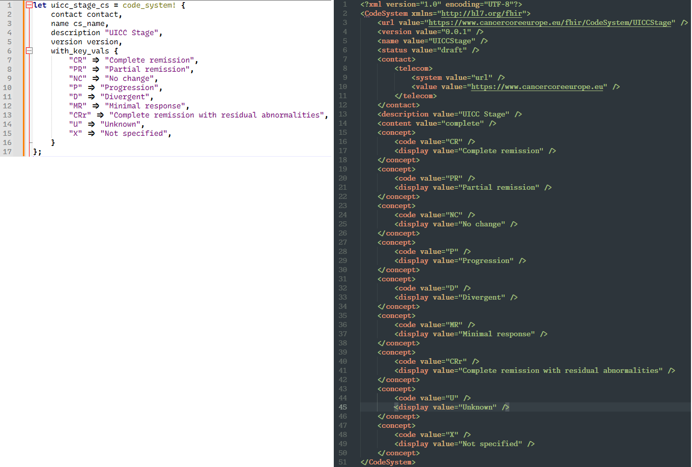
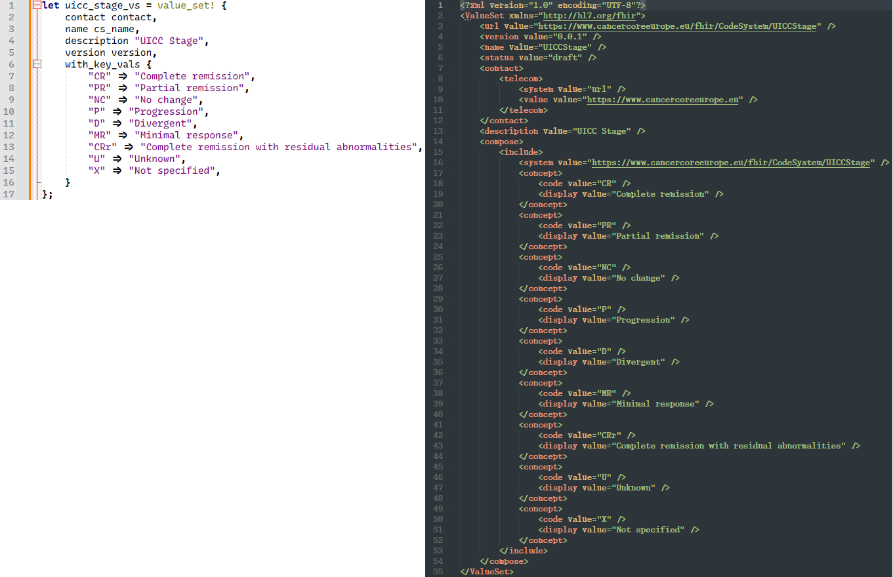
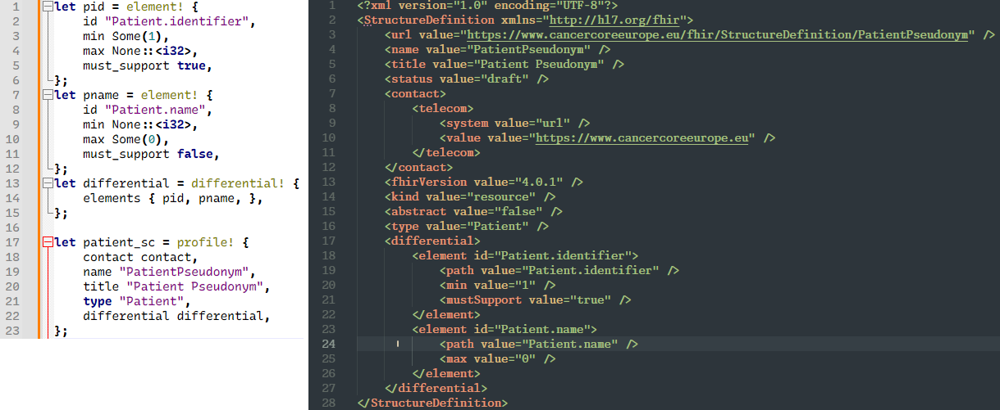

# DSLs in Rust

This is my very first attempt at writing a DSL, and it's a cool coincidence that I am using Rust for this task 😉 so let's begin with some basics.

## Macros & Metaprogramming

Fundamentally, macros are a way of *writing code that writes other code*, which is known as **metaprogramming**. So, the program which we write, *treats code as data*. Well, if this reminds of you Lisp(s) or Clojure, then you are right, because of the famous adage `code as data and data as code`, which all Lisp-y languages are associated with.

### So, why should I care?

Well, it reduces / removes boilerplate, enforces patterns & most importantly, lets you create higher-level (or *domain-specific*) abstractions (as we'll see shortly).

## Domain-Specific Language (DSL)

So, what is a DSL? A DSL is a *programming language or syntax* specifically designed to solve problems in a *particular domain*. **It is more expressive and concise for that domain, compared to the general-purpose programming languages.**

Examples:
- **SQL**: A DSL for querying databases (relational data)
- **HTML**: A DSL for structuring web content
- **Rust macros**: Can be used to create DSLs for specific tasks, like defining enums or data structures

### Internal vs External DSLs

#### Internal DSL

An internal DSL is built within an existing general-purpose language. It uses the syntax and features of the host language to define domain-specific constructs.

Example: Rust macros (`macro_rules!`) are internal DSLs because they extend Rust's syntax while still being part of the Rust language.

#### External DSL
An external DSL is a completely separate language with its own syntax and parser. It requires its own tooling (e.g., a parser or interpreter) to integrate with the host language.

Example: `SQL` is an external DSL that is parsed and executed by a database engine.

So, to summarize:
- **Metaprogramming** enables creating DSLs
- **Internal DSLs** extend the host language, while **external DSLs** are standalone languages

## Rust macros

Let's talk about Rust macros now - the tool which enables us to create our DSL. Be sure to read the [Macros](https://doc.rust-lang.org/book/ch20-05-macros.html) chapter of the Rust-lang book to get a basic understanding of macros.

So every Rust programmer has used some or the other built-in macros:

- `println!` or `vec!` - basically, anything which ends with a `!` is a Rust macro
- Custom `#[derive]` macros that specify code added with the `derive` attribute used on structs and enums

Rust supports two broad types of macros:

- **Declarative macros** also sometimes referred to as *macros by example*, created using (`macro_rules!`) - they let you define patterns and expand them into Rust code
- **Procedural macros** allow you to write custom code transformations at compile time, and are of three kinds:
 
    - *Custom #[derive]* macros that specify code added with the derive attribute used on structs and enums
    - *Attribute-like* macros that define custom attributes usable on any item
    - *Function-like* macros that look like function calls but operate on the tokens specified as their argument

## Motivation

So why did I think of writing this DSL (or Rust macros)? Last year, I had to create [FHIR](https://www.hl7.org/fhir/) profiles for my current project, [CCE](https://www.cancercoreeurope.eu/). As you may know, these profiles are represented in XML. I had to copy existing profiles (from another project) which were in German - so I had to manually translate the German strings into English (thanks to Google Translate & DeepL). I had to make some other (required) changes too, and obviously, creating XML files by hand is tedious & error prone (because mostly, XML & JSON files are serialized from data structures in one or the other prog langs).

### Examples

So let's see some examples and then you may decide if this is helpful or not?

**Setting contact details once** -

```rust
let base_url = "https://www.cancercoreeurope.eu";
let version = "0.0.1";

let contact = contact! { url base_url };
```

1. **Generating a CodeSystem** - here, you see the `code_system!` macro in action



2. **Generating a ValueSet** - here, you see the `value_set!` macro in action



3. **Generating a Profile** - here, you see the `element!, differential! & profile!` macros in action



#### Comparison

If we just compare, the no. of lines required to use a macro, vs. the no. of lines of code generated, you'll see a substantial difference -

| Macro | Line count (macro) | Line count (generated XML) |
|-------|--------------------|----------------------------|
| code_system! | 17 | 51 |
| value_set! | 17 | 55 |
| profile! | 23 | 28 |

## Takeaways

So as you can see:

- I've created my own **domain-specific abstractions** (in Rust) - a `CodeSystem / ValueSet & Profile` are all different kinds of FHIR resources
- There is a measurable code reduction - I am able to generate a lot of (XML) code with a lot less Rust code
- It is less erroneous - I am instantiating contact details once and passing it to other macros
- And finally, we can use these macros from other Rust code

## How does it look like?

Well, here's the code for the `contact!` macro (thanks to the [fhirbolt](https://docs.rs/fhirbolt/latest/fhirbolt/) crate which I am using) -

```rust
#[macro_export]
macro_rules! contact {
    (url $url:expr) => {{
        use fhirbolt::model::r4b::types::{ContactDetail, ContactPoint};

        let contact_point = ContactPoint {
            system: Some("url".to_string().into()),
            value: Some($url.to_string().into()),
            ..Default::default()
        };

        let contact_detail = ContactDetail {
            telecom: vec![contact_point],
            ..Default::default()
        };

        contact_detail
    }};
}
```

Now obviously, this is a very basic implementation and it'll take a lot more effort to make it production-ready, but from my PoV, *it's already working, pleasing to the eye and helps to solve a problem* - **creating XML files by hand** 😢.

And the coolest part? **Using Rust macros to create a DSL** 😉✌️
